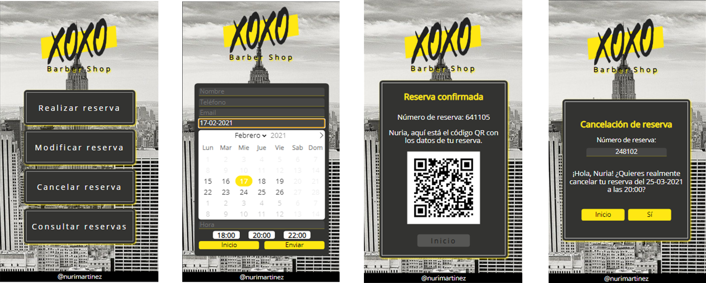

  

Introducción
-------------
Primera aplicación conjunta con Node.js para la reserva de citas en pequeños comercios. Además, permite la consulta de reservas ya realizadas, la modificación de las pendientes y la cancelación de las mismas. 

  

Descripción
-------------
* Aplicación con diseño exclusivo para móvil.
* Reserva de citas solamente en horarios disponibles mostrados con Flatpickr y petición AJAX.
* Envío de correos electrónicos para la confirmación de cita y el resguardo de la reserva con código QR.
* Modificación y cancelación de las citas pendientes.
* Consulta de las reservas pasadas y pendientes asociadas a un correo electrónico.
* Primeros pasos en el uso de asincronía con JavaScript.
* Almacenamiento de datos en archivos .JSON.

Características
-------------
* HTML5, CSS3, JS
* SCSS
* [Node.js](https://nodejs.org/es/)
* [Express.js](https://expressjs.com/es/)
* [Express-handlebars](https://www.npmjs.com/package/express-handlebars)
* [Flatpickr](https://flatpickr.js.org/)
* [Nodemailer](https://nodemailer.com/about/)
* [QRcode](https://www.npmjs.com/package/qrcode)

Colaboración
-------------

